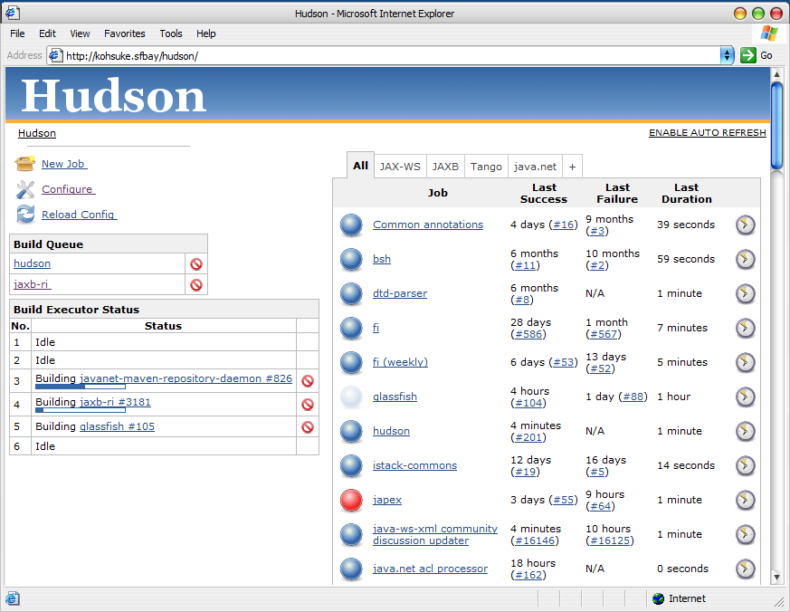
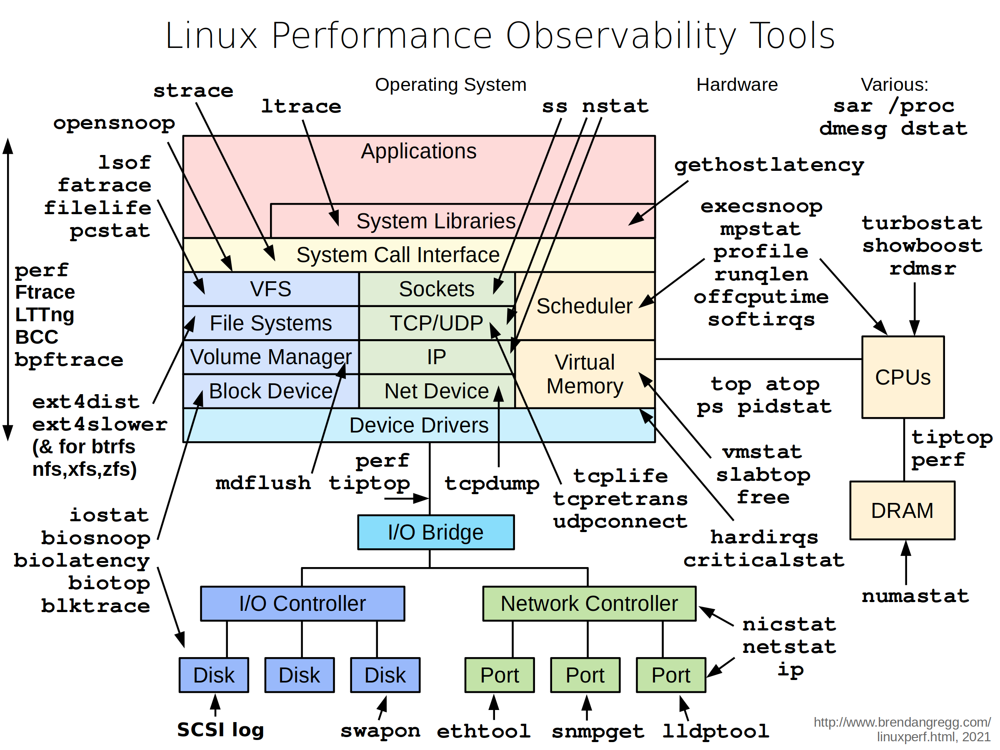

# Outline

- Purpose
- History
- Deployment
- Use
- Future

# Purpose: automated testing

Automated testing is essential in scientific software because it enforces rigor, protects reproducibility, and prevents silent regressions that can corrupt results or invalidate published findings. It guarantees that complex numerical pipelines remain trustworthy as models evolve.

# Purpose: automated testing of GLOBIOM to:

- Catch regressions and errors early in the development cycle
- Reduce manual testing burden
- Expand test coverage far beyond what would be practical manually
- Produce metrics for verifying/improving model code/performance/outcomes
- Integrate with version control for traceable changes
- Guard cross-platform and containerization compatibility
- Increase confidence in model results

# Automated testing of everyday software

Automated testing for everyday software can be simple and light because most features can be checked in small pieces, one at a time, on a regular laptop. Developers can quickly run these tiny checks while they work, catching mistakes early—long before the software becomes big or complex. This doesn’t require a large testing system or special infrastructure; it’s more like proofreading each paragraph as you write, instead of waiting to review the whole book at the end.

# Purpose: testing big GAMS models

Large, data‑heavy GAMS models cannot be tested the way everyday software can because their behavior depends on running the *entire* system at once. They pull in huge datasets and interact through tightly linked equations, so changing one part affects everything else. You can’t check them in tiny pieces on a laptop—only full, time‑consuming runs reveal whether results still make sense. These models behave like whole ecosystems: only by simulating the complete environment can you see if a change truly works.

**⇒ a resource-heavy custom approach is required.**

# Purpose: overcome challenges

- Acquiring resources in a provisionable format.
- Scaling  resources with demand.
- GLOBIOM VCS is on Subversion (internal only)
- GLOBIOM is partially on P: (internal only)
- Making the testing available as a service to the team.
- Dealing with Ann Ominous

# Ann Ominous

# Windows Ann Ominous

# Jenkins (sign in demo)

A self‑hosted test-automation engine prized for its deep configurability. It remains broadly adopted—about 28% usage in 2026—especially where there is need for full control of tailored on‑prem test pipelines.

The core GLOBIOM team can sign in to the Jenkins GLOBIOM test service at **https://jenkins.iiasa.ac.at**

---

# History: Hudson

-  **2004** — ➡ [**Kohsuke Kawaguchi**](https://en.wikipedia.org/wiki/Kohsuke_Kawaguchi) creates [**Hudson**](https://grokipedia.com/page/Hudson_%28software%29) at **Sun Microsystems** as a Java‑based CI tool to automate builds and spare his team broken integrations.
-  **2005** — Hudson’s first public release ships as an open‑source and quickly gains traction.

# History: Hudson

-  **2004** — [**Kohsuke Kawaguchi**](https://en.wikipedia.org/wiki/Kohsuke_Kawaguchi) creates [**Hudson**](https://grokipedia.com/page/Hudson_%28software%29) at **Sun Microsystems** as a Java‑based CI tool to automate builds and spare his team broken integrations.
-  **2005** — ➡ Hudson’s first public release ships as an open‑source and quickly gains traction.

# History: Hudson screenshot

# Emerging Linux dominance

- **2006-2009** — Linux started to dominate, impacting Sun business model.

---

{width=33%}

# History: Jenkins

-  **2010** — After **Oracle acquires Sun**, tensions rise as Oracle asserts control and seeks to trademark the **Hudson** name, triggering governance disputes.

---

{width=24%}

{width=24%}

# History: Jenkins

-  **Early 2011** — The community, led by Kawaguchi, **forks Hudson into Jenkins**, rejecting Oracle’s stewardship.
-  **2011** — Kawaguchi departs and co‑founds **CloudBees**, becoming the commercial steward and evangelist of Jenkins’ future ecosystem.
-  **2011 onward** — **Jenkins**—the renamed, community‑owned continuation—quickly eclipses Hudson, becoming the dominant CI platform with a vast plugin ecosystem.

# Jenkins ecosystem (plugin demo)

The rich Jenkins ecosystem features a **vast plugin library (2,000+ plugins)** that enables flexible, end‑to‑end automation across nearly any technology stack, powered by a large and active open‑source community that continuously expands its capabilities.

---

# History: CTBTO (free-style configuration demo)

Jenkins for automated testing of seismic, hydroacoustic, and infrasound processing software.

- Virtual machine (VM) image with integrated Oracle database.
- Scaled by deploying more "worker agent" VM instances.
- "Free style" GUI-configured Jenkins projects.

# History: mitigating the Jenkins Web-UI monstrosity

- **Pipeline**: scripts for test description.
- **Configuration as code**: serialize configuration settings as text.
- To be managed via **Git**.
  * See https://iiasa.github.io/Data_Stewards/managing-code-and-data.html

---

# History: IIASA

Ominous challenges. Set up a **Jenkins test server** using test pipeline scripts. Deployed on Linux via many tickets. Issues with:

- By-proxy maintenance and upgrades.
- Slow storage.
- Multi-tenancy resource exhaustion.
- Outages.
- No scaling.
- Added a `Jenkinsfile` pipeline script to the GLOBIOM Trunk.
- Automated testing of GLOBIOM as far as the test server would allow.

# History: readying GLOBIOM for testing

Readied the GLOBIOM Fable, GLOBIOM Prerelease, and GLOBIOM Trunk for automated testing:

- Removed platform dependencies:
  * Converted use of GDXXRW/Office to xl2gdx.R/gdxrrw.
  * Path casing errors.
  * Path separators.
  * FILE statement delimiting.
  * ...
- Normalized `Model/0_executebatch.gms`, added `include/environment.gms`, ...
- Mirrored `P:` data GLOBIOM needs on GitLab.

# History: Kubernetes

**Kubernetes:** helps coordinate computers to jointly run apps like Jenkins or the Accelerator so that they can grow smoothly when needed. **Let's use Kubernetes!**

Five years later, after several false starts, bartered into being a usable Kubernetes cluster for IBF by sacrificing limpopo 2, 3, and 4. And then buying more storage.

Also used for Accelerator "routines".

# Now: Jenkins test service deployed on IBF Kubernetes cluster

A mashup of container build scripting, Kubernetes orchestration resources, configuration as code, Jenkins plugins, and `Jenkinsfile` pipeline scripting, all managed with Git.

- Instantiates clean-slate **test agents** for every test run.
- Pulls GLOBIOM from GitHub/Subversion and P: data from GitLab.
- Patches GLOBIOM for testing
- Runs GLOBIOM from A to Z.
  * For all code-path-modifying off-by-one-from-default settings.

# Agent container

- Has all the IBF canonical GAMS versions, R, Python, and packages that GLOBIOM needs.
- Also instrumented for GAMS post-mortem.

---

# GLOBIOM testing (demo)

- Views
- Projects
- Parameters
- Pipeline
- Build
- Changes
- Plots/Metrics
- Emails/Issues

# Future

- Expand plots/metrics
- Add more branches
- Scale up storage
- GitHub issue tracking integration
- Integrate **GAMS dig** analysis
- More agent kinds or Jenkins instances
- ...
